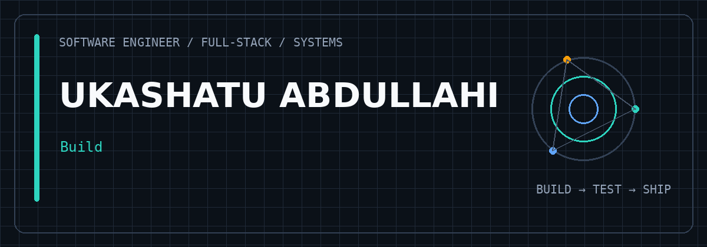
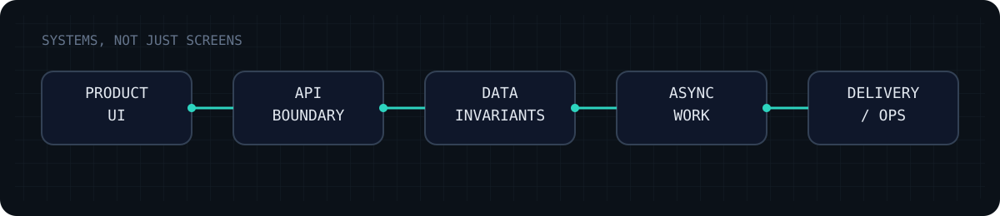
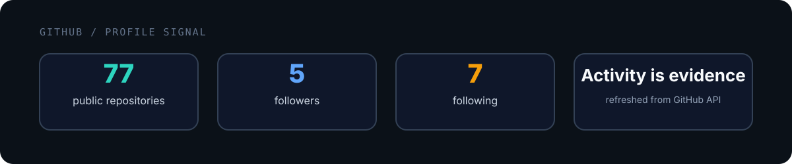
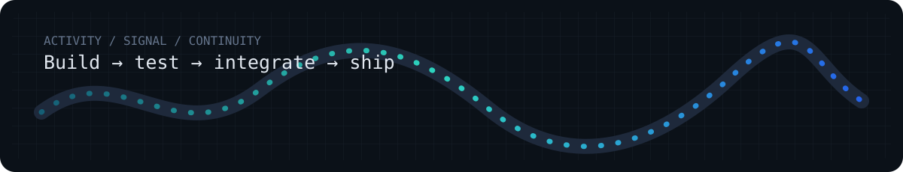
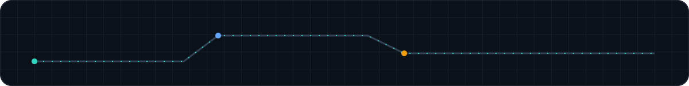

# UKASHATU ABDULLAHI

### Software Engineer · Full-Stack · Backend / Systems

Building complete software products across interfaces, APIs, data, and infrastructure.

  <a href="https://github.com/Ukashatu40">GitHub</a> ·
  <a href="https://www.linkedin.com/in/ukashatu-abdullahi-17b4312b0/">LinkedIn</a> ·
  <a href="mailto:ukasha.abdul.dev@gmail.com">Email</a>

---

## What I Build

I work across the full path from product interface to backend systems. My strongest technical focus is backend and systems engineering, but the products I build increasingly include the frontend application, API layer, data model, authentication, infrastructure, and delivery workflow as one system.

I am particularly interested in software where correctness, reliability, security, and operational behavior matter: financial workflows, API orchestration, event-driven systems, data-heavy applications, and production-oriented web products.

## Engineering Focus

| Product engineering | Backend & systems | Data & infrastructure |
|---|---|---|
| Full-stack web applications | API architecture | PostgreSQL / Prisma / TypeORM |
| React / Next.js interfaces | State machines & workflow logic | Redis / queues / caching |
| Authentication & authorization | Idempotency & concurrency | Docker / Linux / deployment |
| Real product workflows | Event-driven processing | Observability / CI/CD |

## Selected Systems

### 01 · Double-Entry Accounting Ledger

**`double-entry-accounting-ledger-system`**

A TypeScript/NestJS financial ledger centered on double-entry accounting, immutable auditability, advisory-lock-based concurrency control, idempotent state changes, multi-currency processing, reporting, and role-based API access. The repository also documents a PostgreSQL schema, OpenAPI contract, database triggers, testing strategy, and deployment flow.

`NestJS` `Fastify` `PostgreSQL` `Prisma` `SHA-256` `Docker`

[Repository](https://github.com/Ukashatu40/double-entry-accounting-ledger-system)

### 02 · Payment Orchestration Engine

**`payment-orchestration-engine`**

A NestJS/Fastify payment orchestration backend with gateway adapters, multi-criteria routing, circuit breakers, idempotency, transaction state transitions, webhook processing, reconciliation, and failure-scenario testing across multiple payment providers. The repository documents the architecture and explicitly covers replay protection, duplicate events, concurrent races, and gateway failure behavior.

`TypeScript` `NestJS` `Fastify` `PostgreSQL` `TypeORM` `Docker`

[Repository](https://github.com/Ukashatu40/payment-orchestration-engine)

### 03 · Event-Driven Notification Engine

**`event-driven-notification-engine`**

An event-driven notification platform using Kafka for event streaming, RabbitMQ for delivery queues, Redis for caching and distributed controls, PostgreSQL for state and audit data, and Prometheus/Grafana for observability. It also documents JWT/RBAC, encrypted PII, provider failover, DLQs, real-time operational analytics, and end-to-end testing.

`TypeScript` `NestJS` `Kafka` `RabbitMQ` `Redis` `PostgreSQL` `Docker`

[Repository](https://github.com/Ukashatu40/event-driven-notification-engine)

### 04 · Ratel Financial Platform

**`ratel-financial-platform`**

A NestJS/Fastify backend with PostgreSQL/Prisma, Redis-backed queues and throttling, JWT/Passport authentication, Swagger, health checks, OpenTelemetry/Prometheus instrumentation, S3 integration, file scanning, logging, and unit/integration/e2e test configurations. The repository currently has substantial implementation structure but minimal public-facing repository metadata, making documentation and GitHub presentation a clear improvement area.

`TypeScript` `NestJS` `Fastify` `Prisma` `PostgreSQL` `Redis` `AWS S3`

[Repository](https://github.com/Ukashatu40/ratel-financial-platform)

## Stack

### Core

`TypeScript` · `JavaScript` · `NestJS` · `Node.js` · `React` · `Next.js` · `PostgreSQL` · `Docker` · `Git`

### Working With

`Java` · `Spring Boot` · `Python` · `MongoDB` · `Redis` · `WebSockets` · `CI/CD` · `Linux` · `AWS`

### Engineering Practices

`REST APIs` · `Authentication` · `Authorization` · `RBAC` · `Idempotency` · `Concurrency Control` · `Event-Driven Architecture` · `Queues` · `Caching` · `Observability` · `Testing`

## GitHub Activity

The contribution calendar below is GitHub's own profile activity. I keep the custom README analytics intentionally compact so activity supports the engineering story instead of replacing it.

## Contribution Visualization

The custom visual above is deliberately supplementary. GitHub's native contribution calendar remains the source of truth for activity history.

## Engineering Notes

I like systems that make important behavior explicit in code: state transitions instead of hidden mutations, database constraints instead of assumptions, idempotency around externally-triggered operations, observable failure paths, and tests that exercise concurrency and integration boundaries.

The repositories above already contain examples of these patterns, including database-level immutability, advisory locks, transaction state machines, HMAC validation, deduplication, circuit breakers, asynchronous delivery, deployment configuration, and architecture decision records.

## Currently Building

A growing portfolio of full-stack software systems where the frontend, API, database, infrastructure, and operational concerns are considered together.

## Connect

<a href="https://github.com/Ukashatu40">GitHub</a> ·
<a href="https://www.linkedin.com/in/ukashatu-abdullahi-17b4312b0/">LinkedIn</a> ·
<a href="mailto:ukasha.abdul.dev@gmail.com">Email</a>

Software is the artifact. Engineering is the discipline behind it.

